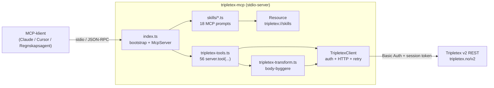
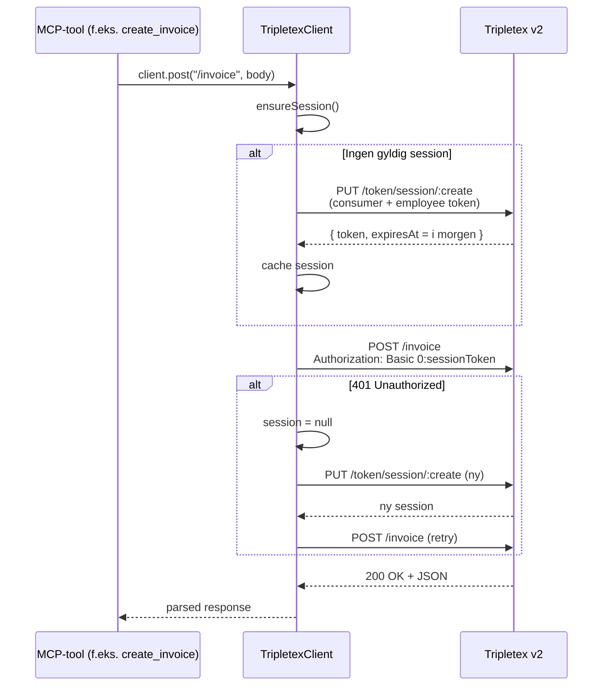

# Tripletex MCP Server

En open source [MCP-server](https://modelcontextprotocol.io/) som lar AI-assistenter (Claude, Cursor, osv.) jobbe direkte mot Tripletex sitt regnskapssystem.
Se hvordan du installerer repo og kobler på under.

**Foretrekker du en ferdigkonfigurert MCP-løsning?** Prøv: [Regnskapsagent.no](https://regnskapsagent.no/)

Bygd og vedlikeholdt av [CWV Ventures AS](https://cwv.no).

## Trenger du hjelp til implementering?
Kontakt meg på carl@cwv.no.

## I korte trekk

- **56 MCP-verktøy** dekker ordre, faktura, leverandørfaktura, bilag, hovedbok, rapporter, prosjekt, timer, HR og reiseregning.
- **18 regnskapsflyter (skills)** — norsk-språklige steg-for-steg-guider som aktiveres via MCP-prompts.
- **Tynn, presis proxy over Tripletex v2** — feltnavn matcher API-ets DTO-er verbatim, slik at LLM-en får riktig feedback og kan selvkorrigere.
- **Automatisk autentisering** — consumer + employee token byttes til kortlevd session token, caches til midnatt CET og fornyes ved 401.
- **Stdio transport** per MCP-spesifikasjonen; kan kobles på Claude Desktop, Cursor, eller andre MCP-klienter.

## Arkitektur

MCP-serveren er delt i tre lag: tynn proxy (`tripletex-client.ts`), body-byggere (`tripletex-transform.ts`) og 56 tool-registreringer + 18 skills (`tripletex-tools.ts`, `skills/`). LLM-klienten snakker med serveren over stdio; serveren snakker med Tripletex v2 over HTTPS.



**Hvor hver ting lever:**

| Fil | Ansvar |
|---|---|
| [src/index.ts](src/index.ts) | Stdio-bootstrap, `McpServer`-instans, kobler klient til tools. |
| [src/tripletex-tools.ts](src/tripletex-tools.ts) | Alle 56 `server.tool(...)`-registreringer med Zod-schemas og korte agent-instruksjoner. |
| [src/tripletex-transform.ts](src/tripletex-transform.ts) | Rene funksjoner som bygger Tripletex-JSON fra MCP-input (f.eks. `buildOrderBody`, `buildSupplierInvoiceVoucherBody`). |
| [src/tripletex-client.ts](src/tripletex-client.ts) | Autentisering, session-caching, `fetch`-wrapper, 401-retry, multipart-opplasting. |
| [src/skills/](src/skills/) | 18 regnskapsflyter som MCP prompts, pluss ressursen `tripletex://skills`. |

### Autentiseringsflyt

Tripletex bruker ikke én API-nøkkel — applikasjonen identifiseres med **consumer token**, brukeren med **employee token**, og hvert faktisk API-kall signeres med en kortlevd **session token**. MCP-serveren håndterer hele vekslingen transparent:



## Hva kan den gjøre?

**56 MCP-verktøy** fordelt på 9 kategorier (per **v2.4.0**, synket med [Regnskapsagent](https://regnskapsagent.no)-MCP):

| Kategori | Antall | Dekker |
|---|---:|---|
| Ordrer & utgående faktura | 7 | Søk/opprett ordre, fakturering, søk fakturaer |
| Leverandørfaktura | 8 | Søk, godkjenning, oppdater posteringer, bilagsmottak |
| Kunder & leverandører | 7 | Søk, opprett, oppdater på begge sider |
| Produkter | 2 | Søk og opprett produkt |
| Bilag & hovedbok | 10 | Kontoplan, MVA, bilagstyper, bilag, vedlegg, hovedbok |
| Rapporter | 1 | Saldobalanse |
| Prosjekt, time & HR | 7 | Prosjekt, aktivitet, timer, ansatt, avdeling |
| Reise & kjøregodtgjørelse | 12 | Reiseregning, kjøring, km-satser, kostnader, approval |
| Utility | 2 | `whoami`, `search_employees` |

<details>
<summary><strong>Vis full liste over alle 56 verktøy</strong></summary>

| Kategori | Verktøy | Beskrivelse |
|---|---|---|
| **Ordrer & utgående faktura** | `search_orders` | Søk ordrer (åpne/lukkede, abonnement m.m.) |
| | `get_order` | Hent én ordre |
| | `create_order` | Opprett ordre |
| | `invoice_order` | Fakturer ordre |
| | `create_invoice` | Ordre + faktura i ett steg |
| | `search_invoices` | Søk utgående fakturaer (datointervall) |
| | `get_invoice` | Hent én faktura |
| **Leverandørfaktura** | `search_supplier_invoices` | Søk registrerte leverandørfakturaer |
| | `get_supplier_invoice` | Hent én leverandørfaktura |
| | `get_supplier_invoices_for_approval` | Liste til godkjenning |
| | `approve_supplier_invoice` | Godkjenn |
| | `reject_supplier_invoice` | Avvis |
| | `update_supplier_invoice_postings` | Oppdater posteringer på leverandørbilag |
| | `create_supplier_invoice` | Opprett leverandørbilag til bilagsmottak (`POST /ledger/voucher`, m.fl.) |
| | `get_voucher_inbox_count` | Antall i bilagsmottak |
| **Kunder & leverandører** | `search_customers` | Søk kunder |
| | `create_customer` | Opprett kunde |
| | `update_customer` | Oppdater kunde |
| | `search_suppliers` | Søk leverandører |
| | `create_supplier` | Opprett leverandør |
| | `get_supplier` | Hent leverandør |
| | `update_supplier` | Oppdater leverandør |
| **Produkter** | `search_products` | Søk produkter |
| | `create_product` | Opprett produkt |
| **Bilag & hovedbok** | `search_accounts` | Søk kontoplan |
| | `search_vat_types` | MVA-typer |
| | `search_voucher_types` | Bilagstyper |
| | `search_vouchers` | Søk bilag |
| | `get_voucher` | Hent bilag |
| | `create_voucher` | Opprett bilag |
| | `send_voucher_to_ledger` | Send bilag til bokføring |
| | `attach_voucher_document` | Vedlegg dokument (Base64) til bilag |
| | `import_ledger_voucher_document` | Importer bilag fra fil |
| | `search_ledger_postings` | Søk hovedboksposteringer |
| **Rapporter** | `get_balance_sheet` | Saldobalanse for periode |
| **Prosjekt & time** | `search_projects` | Søk prosjekter |
| | `search_activities` | Søk aktiviteter |
| | `search_time_entries` | Søk timeføringer |
| | `create_time_entry` | Logg timer |
| | `create_project` | Opprett prosjekt |
| | `create_department` | Opprett avdeling |
| **HR** | `create_employee` | Opprett ansatt |
| **Reise & kjøregodtgjørelse** | `search_travel_expenses` | Søk reiseregninger |
| | `get_travel_expense` | Hent reiseregning |
| | `create_travel_expense` | Opprett reiseregning |
| | `create_mileage_allowance` | Kjøregodtgjørelse |
| | `search_mileage_allowances` | Søk kjøregodtgjørelser |
| | `search_mileage_rates` | km-satser |
| | `search_mileage_rate_categories` | Satskategorier |
| | `deliver_travel_expense` | Lever til godkjenning |
| | `approve_travel_expense` | Godkjenn |
| | `create_travel_expense_cost` | Kostnad (parkering, bom, …) |
| | `search_travel_expense_cost_categories` | Kostnadskategorier |
| | `search_travel_expense_payment_types` | Betalingstyper |
| **Utility** | `whoami` | Sesjon / selskap |
| | `search_employees` | Søk ansatte |

</details>

## Skills (regnskapsflyter)

I tillegg til verktøyene eksponerer serveren **18 regnskapsflyter** som MCP prompts — norsk-språklige playbooks som hjelper LLM-en å kjøre vanlige operasjoner i riktig rekkefølge, med korrekt MVA-håndtering og validering underveis. Flyter er indeksert som ressursen `tripletex://skills` slik at klienten kan slå opp triggere automatisk.

| Tier | Skill-id | Flyt | Typiske triggere |
|---|---|---|---|
| Core | `create-invoice` | Opprett utgående faktura med korrekt MVA | faktura, invoice, fakturere, utgående faktura |
| Core | `post-voucher` | Bilagsføring med debet/kredit og NS 4102-kontoplan | bilag, voucher, bokføring, postering |
| Core | `register-supplier-invoice` | Registrer leverandørfaktura (inkl. bilagsmottak) | leverandørfaktura, inngående faktura, bilagsmottak |
| Core | `customer-management` | Søk, opprett og oppdater kunder | kunde, ny kunde, kundeoppslag |
| Common | `time-to-invoice` | Konverter loggede timer til faktura | timer til faktura, fakturere timer |
| Common | `credit-note` | Utsted kreditnota på eksisterende faktura | kreditnota, kreditere, tilbakebetaling faktura |
| Common | `balance-check` | Saldobalanse og kontooversikt for periode | saldobalanse, kontooversikt, periode avslutning |
| Common | `create-product` | Opprett produkt for ordre/faktura | produkt, vare, tjeneste |
| Common | `register-payment` | Registrer innbetaling/utbetaling | betaling, innbetaling, utbetaling |
| Common | `create-employee` | Onboard ansatt med norske krav | ansatt, ny ansatt, onboarding |
| Common | `create-project` | Opprett prosjekt for timer/fakturering | prosjekt, nytt prosjekt |
| Common | `create-departments` | Opprett avdeling/kostnadssted | avdeling, department, kostnadssted |
| Advanced | `run-payroll` | Lønnskjøring med skatt og arbeidsgiveravgift | lønn, payroll, lønnsberegning |
| Advanced | `year-end-closing` | Årsoppgjør etter norsk regnskapslov | årsoppgjør, årsregnskap, årsavslutning |
| Advanced | `month-end-closing` | Månedsslutt og MVA-oppgjør | månedsslutt, mva-oppgjør, terminoppgave |
| Advanced | `bank-reconciliation` | Bankavstemming mot konto 1920 | bankavstemming, avstemming, bankbalanse |
| Advanced | `travel-expense` | Reiseregning og kjøregodtgjørelse | reiseregning, diett, kjøregodtgjørelse |
| Advanced | `receipt-expense` | Utlegg / kvittering mot konto 2930 | utlegg, kvittering, refusjon |

Full kildekode for hver flyt ligger i [src/skills/](src/skills/). Registry og ressurs-definisjon: [src/skills/registry.ts](src/skills/registry.ts).

## Kom i gang

### 1. Hent API-nøkler fra Tripletex

Du trenger to tokens:

- **Consumer token** — søk om produksjonstilgang via [developer.tripletex.no](https://developer.tripletex.no). Godkjenning tar typisk 2–3 uker. For testing kan du opprette en gratis testkonto med egne tokens.
- **Employee token** — opprettes i Tripletex under **Innstillinger → Integrasjoner → API-tilgang** av en bruker med admin-rettigheter.

### 2. Installer

```bash
git clone https://github.com/cwv-ventures/tripletex-mcp.git
cd tripletex-mcp
npm install
npm run build
```

### 3. Koble til Claude Desktop

Legg til følgende i Claude Desktop sin konfigurasjonsfil:

**macOS:** `~/Library/Application Support/Claude/claude_desktop_config.json`
**Linux:** `~/.config/claude-desktop/claude_desktop_config.json`

```json
{
  "mcpServers": {
    "tripletex": {
      "command": "node",
      "args": ["/absolutt/sti/til/tripletex-mcp/dist/index.js"],
      "env": {
        "TRIPLETEX_CONSUMER_TOKEN": "din-consumer-token",
        "TRIPLETEX_EMPLOYEE_TOKEN": "din-employee-token"
      }
    }
  }
}
```

### 4. Testmiljø

For å bruke Tripletex sitt testmiljø (`api-test.tripletex.tech`) istedenfor produksjon, legg til:

```json
"TRIPLETEX_ENV": "test"
```

i `env`-blokken.

## Hvordan autentisering fungerer

Serveren håndterer alt automatisk:

1. Ved første kall opprettes en session token via `PUT /v2/token/session/:create`
2. Session token fornyes automatisk når den utløper (midnatt CET)
3. Alle API-kall bruker Basic Auth med brukernavn `0` og session token som passord

Du trenger ikke tenke på dette — bare sett consumer og employee token som miljøvariabler. Se [autentiseringsflyten](#autentiseringsflyt) over for detaljer.

## Eksempler på bruk

Når MCP-serveren er koblet til Claude, kan du si ting som:

> "Logg 7.5 timer på prosjekt Konsulentbistand i dag"

Claude finner prosjektet, velger riktig aktivitet, og oppretter timeoppføringen.

> "Vis alle fakturaer til Nordvik Bygg fra mars 2026"

Claude søker kunder, finner riktig ID, og henter fakturaene.

> "Opprett ny kunde Havbruk Nord AS med org.nr 912 345 678"

Claude oppretter kunden direkte i Tripletex.

> "Hvilke bilag ble ført forrige uke?"

Claude søker bilag med datofilter og viser en oversikt.

> "Registrer kjøring fra Oslo til Drammen i dag, 42 km, personbil"

Claude slår opp satskategori for personbil, oppretter en reiseregning, legger til kjøregodtgjørelse med riktig sats, og rapporterer totalbeløp.

> "Jeg kjørte til Ski i dag, 48 km. Hadde 85 kr i bompenger og 120 kr parkering"

Claude oppretter reiseregning med kjøregodtgjørelse pluss kostnadsrader for bompenger og parkering.

## Kvalitetssikring

Dette er en fakta-orientert oversikt over hvordan serveren er bygget — tenkt som referanse for fagpersoner og ledelse.

- **PRD-samsvar mot Tripletex v2.** Tynn proxy, ingen felt-aliaser: `count` (ikke `quantity`), `unitPriceExcludingVatCurrency`/`unitPriceIncludingVatCurrency`, `isPrioritizeAmountsIncludingVat`, `vendorInvoiceNumber`, `amountGross`/`amountGrossCurrency`, `termOfPayment`, og action-endepunkter med kolon-prefiks (`:invoice`, `:sendToLedger`, `:deliver`, `:approve`). Referanser wrappes til `{ id: N }` i transform-laget — utad eksponeres bare `customerId`, `vatTypeId`, osv.
- **Eksklusive to-datoer er dokumentert** i tool-beskrivelsene for `search_supplier_invoices`, `search_vouchers` m.fl. slik at LLM-en unngår den klassiske av-for-én-feilen.
- **Feilhåndtering for LLM self-correction.** Alle Tripletex-feil returneres rått som JSON `{ httpStatus, tripletexResponse }`, ikke som kastede exceptions. LLM-en ser validation-meldinger direkte og kan rette kallet uten menneskelig intervensjon.
- **Autentisering.** Consumer + employee token byttes til en session token som caches til midnatt CET. 401 trigger automatisk fornyelse og én retry. Begge tokens leses fra miljøvariabler (`TRIPLETEX_CONSUMER_TOKEN`, `TRIPLETEX_EMPLOYEE_TOKEN`).
- **Domenekunnskap isolert fra tool-laget.** Forretningsregler som «balanserende kredittpost på konto 2400 for leverandørfaktura» ligger i [src/tripletex-transform.ts](src/tripletex-transform.ts), ikke spredt utover tool-definisjonene.
- **Multi-tenant klar.** `TripletexClient` har både env-basert konstruktør (stdio MCP) og `TripletexClientOptions` for programmatisk bruk — samme kodebase brukes av den hostede Regnskapsagent-MCP-en.
- **Typesikkerhet.** TypeScript `strict` + `Node16` modulmodus. Alle tool-inputs er definert med Zod-schemas og ender som typede argumenter i handlerne.
- **Multipart-opplasting** (`attach_voucher_document`, `import_ledger_voucher_document`) validerer Base64 og håndhever 8 MB-grense før nettkall — beskytter både klient og Tripletex.
- **Optimistisk låsing** på `send_voucher_to_ledger` via `version`-parameter, for å hindre race conditions ved parallell bokføring.
- **Versjon er pinnet** til `2.4.0` i både [src/index.ts](src/index.ts) og [package.json](package.json).
- **Transport** er stdio per MCP-spesifikasjonen; SDK `@modelcontextprotocol/sdk ^1.12.1`.

### Kjent scope (roadmap)

- Ingen automatiserte tester ennå — transform-funksjonene i [src/tripletex-transform.ts](src/tripletex-transform.ts) er første kandidater for enhetstester.
- Ingen eksplisitt 429/backoff-logikk (Tripletex har 5000 req/time; dagens retry dekker kun 401).
- `count`-parameter cappes ikke eksplisitt mot Tripletex' maks (1000).
- Ingen `CHANGELOG.md` — endringer spores i git-historikken.

## Teknisk

- **Arkitektonisk referanse:** [docs/PRD-Tripletex-MCP-Rebuild.md](docs/PRD-Tripletex-MCP-Rebuild.md) — mål-API, DTO-tabeller, feltmapping mot Tripletex v2.
- **Tool-registreringer:** [src/tripletex-tools.ts](src/tripletex-tools.ts) — alle 56 `server.tool(...)`, delt oppsett med Regnskapsagent via `registerAllTools(server, client)`.
- **MCP skills (prompts):** [src/skills/](src/skills/) + ressursen `tripletex://skills`.
- **Runtime:** Node.js 18+
- **Språk:** TypeScript (strict)
- **Avhengigheter:** `@modelcontextprotocol/sdk ^1.12.1`, `zod ^4`
- **Transport:** stdio (standard MCP-protokoll)
- **API:** Tripletex REST API v2 (`tripletex.no/v2` / `api-test.tripletex.tech/v2`)

## Bidra

Pull requests er velkomne! Åpne gjerne et issue hvis du har forslag til nye verktøy eller forbedringer.

## Lisens

MIT — se [LICENSE](LICENSE) for detaljer.
